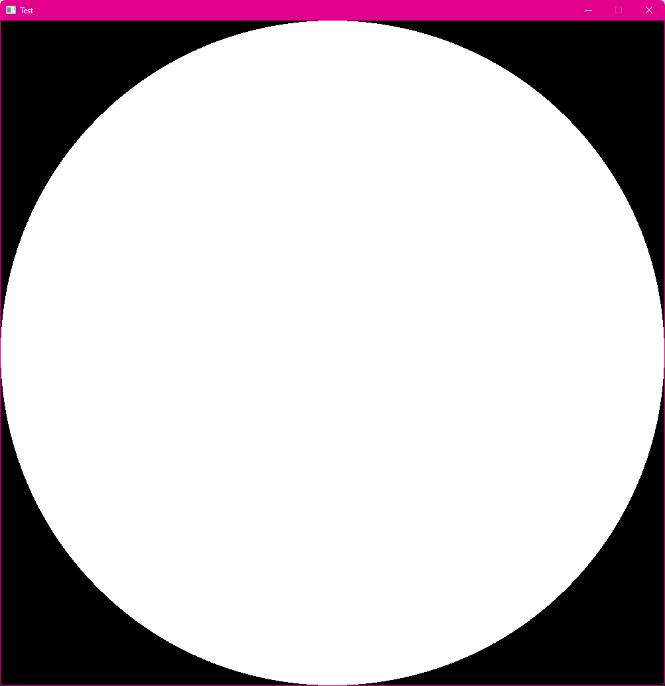

# pancake.drawCircle()

## Description

Draws a circle with given attributes.

## Inputs

- `x` <- Desired X coordinate
- `y` <- Desired Y coordinate
- `r` <- Desired radius

## Outputs

Nothing.

## Example

```Lua
function pancake.event.draw()--Here you draw stuff
  local r = pancake.windowHeight()/2
  pancake.drawCircle(r, r, r)
end
```


This draws a circle at the middle of the screen
