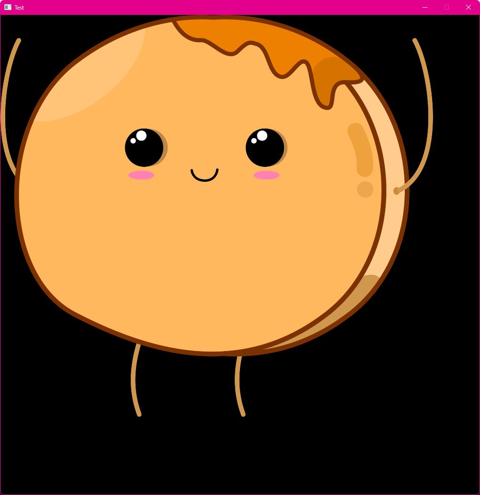

# pancake.drawImage()

## Description

Draws an image with given attributes.

## Inputs

- `image name` <- Name of the image that will be drawn
- `x` <- desired X coordinate of the upper side of the image
- `y` <- desired Y coordinate of the upper side of the image
- `r (0)` <- Rotation of the image **in degrees**. Rotates around origin point
- `sx (1)` <- Scaling factor for width. Use negative values to mirror the image
- `sy (sx)` <- Scaling factor for height. Use negative values to mirror the image
- `ox (0)` <- X coordinate of the rotation origin point
- `oy (0)` <- Y coordinate of the rotation origin point
- `cornerRounding (0)` <- Number that defines how much the corners should be rounded (from 0.0 to 1.0)

## Outputs

Nothing.

## Example

```Lua
function pancake.event.draw()--Here you draw stuff
  pancake.drawImage("hands_up",0,0,0, 0.5)
end
```


The code above will draw image named "hands_up" at the upper left corner of the screen (0,0) with scale of 0.5.
