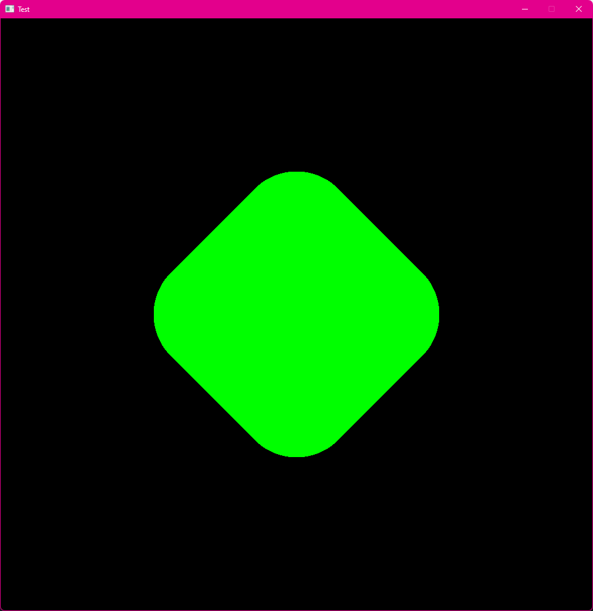

# pancake.drawRectangle()

## Description

Draws a rectangle with given attributes.

## Inputs

- `x` <- X coodrinate of the left side of the rectangle
- `y` <- Y coordinate of the upper side of the rectangle
- `w` <- Width of the rectangle
- `h` <- Height of the rectangle
- `ox (0)` <- X coordinate of the rotation origin point
- `oy (0)` <- Y coordinate of the rotation origin point
- `rotation (0)` <- The angle of rotation **in degrees**
- `cornerRounding (0)` <- Number that defines how much the corners should be rounded (from 0.0 to 1.0)

## Outputs

Nothing.

## Example

```Lua
function pancake.event.draw()--Here you draw stuff
  pancake.setColor(0, 255, 0, 255) -- This sets the drawing color to green
  pancake.drawRectangle(pancake.windowWidth()/2 - 200, pancake.windowHeight()/2 - 200, 400, 400) --Draws a centered square
end
```


The code above will draw a green, 200 pixels wide square at the center of the screen.
