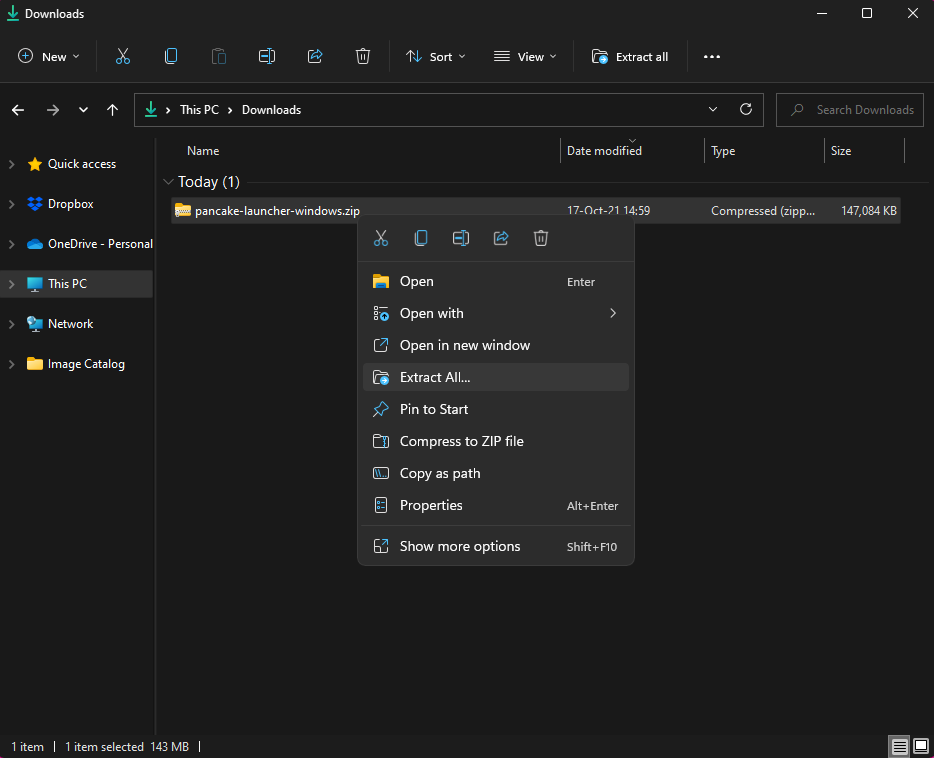
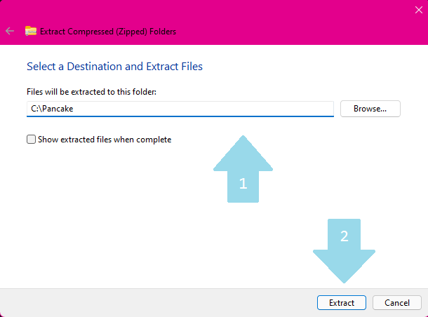

# Getting started

## Installation

### Windows

On windows, click here to [**download**](https://github.com/MightyPancake/pancake-launcher/archive/refs/heads/windows.zip) and then follow the install instructions below.

#### Unzipping

Before using pancake launcher to run your games made in pancake, you have to unzip it. Do not fear though as it's an easy proccess!

First, **locate the file** you've just downloaded and **right-click it!**

Then select **Extract all.**

Then, you'll have to **pick the path** where the engine is going to be located. After that, just hit **Extract**.

And voila! You're all set!

## 
